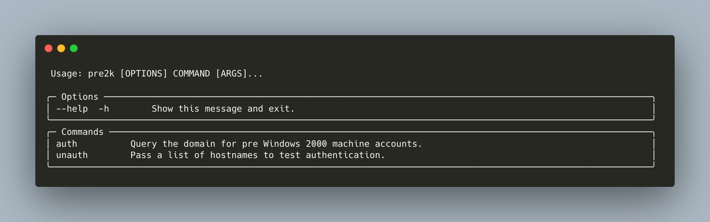
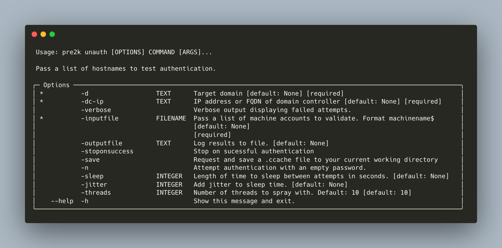
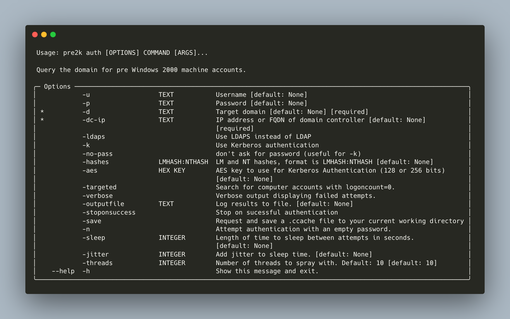

```
                                            ___    __         
                                          /'___`\ /\ \        
             _____   _ __    __          /\_\ /\ \\ \ \/'\    
            /\ '__`\/\`'__\/'__`\ _______\/_/// /__\ \ , <    
            \ \ \L\ \ \ \//\  __//\______\  // /_\ \\ \ \\`\  
             \ \ ,__/\ \_\\ \____\/______/ /\______/ \ \_\ \_\
              \ \ \/  \/_/ \/____/         \/_____/   \/_/\/_/
               \ \_\                                      v3.0    
                \/_/                                          
                                                        @garrfoster
                                                        @Tw1sm       
```

# Pre2k

Pre2k is a tool to query for the existence of pre-windows 2000 computer objects which can be leveraged to gain a foothold in a target domain as discovered by [TrustedSec's](https://www.trustedsec.com/blog/diving-into-pre-created-computer-accounts/) [@Oddvarmoe](https://twitter.com/Oddvarmoe). Pre2k can be ran from an uanuthenticated context to perform a password spray from a provided list of recovered hostnames (such as from an RPC/LDAP null bind) or from an authenticated context to perform a targeted or broad password spray. Users have the flexibility to target every machine or to stop on the first successful authentication as well as the ability to request and store a valid TGT in `.ccache` form in their current working directory.

## Installation

```
git clone https://github.com/rtnvv/pre2k.git
cd pre2k/
pip3 install .
```

## Usage


## Unauthenticated Usage


## Authenticated Usage


## Development
Pre2k uses Poetry to manage dependencies. Install from source and setup for development with:
```
pip3 install poetry
git clone https://github.com/rtnvv/pre2k.git
cd pre2k/
poetry install
poetry run pre2k --help
```

